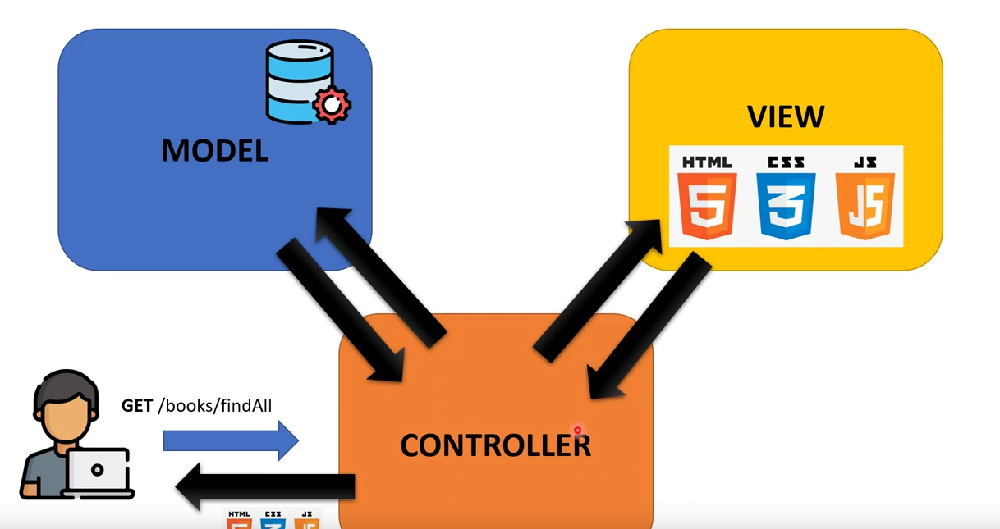
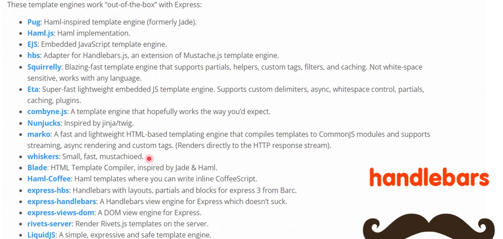

<p align="center">
  <a href="http://nestjs.com/" target="blank"></a>
</p>


## MVC Architecture

check : https://docs.nestjs.com/techniques/mvc




## Installation

```bash
npm install --save hbs


Now create a db by query in the dbeaver or pgadmin

```

create a book.model.ts (like DTO)

make a array of books in service.ts

make a method in service to find all books
make a method in controller (route) to call the above method in service


Create two folders public and view

modify the main.ts with 
```
  const app = await NestFactory.create<NestExpressApplication>(AppModule);

```


we require Template Enginee to render or handle the views


in our project we will be using handlebars

basically they are replacement of just the extension .html with .hbs(handlebars)
* NOTE THE FILE CONTENT IS SAME AS HTML

### Folder and files creation

we create index.hbs with a simple html boiler plate

than add the code of for loop the books is coming from controller and controller is getting from service

than under public folder we create two subfolders js and css and include it in the index.hbs file

and YOUR APP IS running!


giffy
